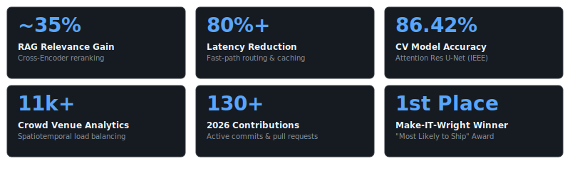

# Hi, I'm Rishindra Mateti

I design and build production-grade AI systems, specializing in multi-agent workflows, optimized RAG pipelines, and low-latency machine learning architectures. Currently engineering conversational onboarding and retrieval architectures as an AI Engineer Intern at ZUZU.AI.

  &nbsp;&nbsp;
  &nbsp;&nbsp;
  

  

  <b>"Every line of code is an opportunity to build something that can reach the world."</b>

