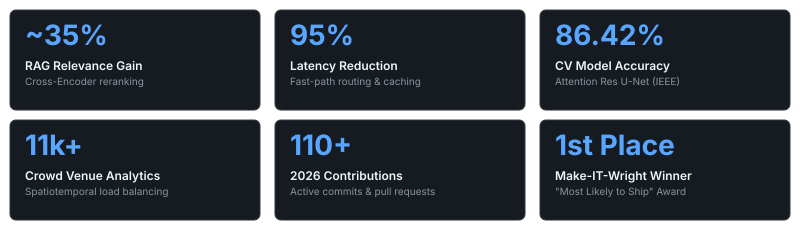

# Hi, I'm Rishindra Mateti

I design and build production-grade AI systems, specializing in multi-agent workflows, optimized RAG pipelines, and low-latency machine learning architectures. Recently completed my Master's in Computer Science at Wright State University, and most recently engineered conversational onboarding and retrieval architectures as a Software Engineer Intern at ZUZU.AI.

  &nbsp;&nbsp;
  

  

  <b>"Every line of code is an opportunity to build something that can reach the world."</b>

